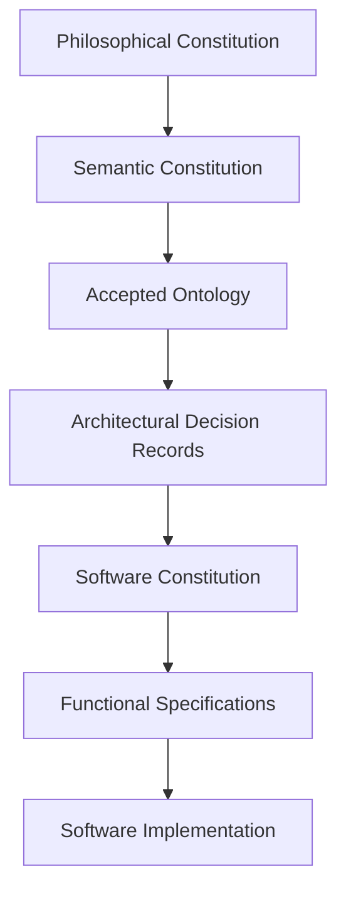

cat /home/pere/.gemini/antigravity-cli/brain/6aa80917-8a4e-46c2-bfe8-8029ad0c7f38/analysis_results.md
# TACE Project Analysis

This document provides a comprehensive summary of the **Tegmark-Aquinas Conceptual Ecosystem (TACE)** codebase, architecture, execution flows, and main modules, along with key questions and inconsistencies identified during the review.

---

## 1. Project Architecture

The TACE system is built on a strict, hierarchical system of governance and layered software separation of concerns.

### 1.1. Hierarchy of Authority
As defined in [AGENTS.md](file:///media/external_drive/llm/pretace/AGENTS.md) and [TACE_SOFTWARE_CONSTITUTION.md](file:///media/external_drive/llm/pretace/docs/constitution/TACE_SOFTWARE_CONSTITUTION.md), all elements of TACE are governed by a strict hierarchy:
1. **Philosophical Constitution**: The highest authority, defining metaphysical commitments (e.g., Logos, Creation, Matrix, Q-Form, Silver Bridge).
2. **Semantic Constitution**: Governs reasoning engine behavior, constraints (e.g., distinction between Creator and created, disjointness of substances), and terminology integrity.
3. **Accepted Ontology**: Authors canonical concepts, definitions, and relationships.
4. **Architectural Decision Records (ADRs)**: Establishes components and contracts (e.g., Resolver and Resolved Concept).
5. **Software Constitution**: Dictates software layers, deployment verification, and testing.
6. **Functional Specifications**: Prescribes what features do.
7. **Underlying Software Implementation**: Python codebase and DB instances.



### 1.2. Architectural Layers
TACE enforces a structural separation of concerns (from **ADR-004**):
* **Ontology Layer**: Canonical definitions and rules.
* **Fact Layer**: Normalized canonical facts extracted from packages.
* **Reasoning Layer**: Executes deterministic derivations (e.g., `IS_A` transitivity) on an immutable `ReasoningContext` producing proof chains.
* **Knowledge Layer**: Aggregates explicit, resolved, and derived facts into a `Derived Knowledge Package` or `Canonical Expansion Package`.
* **Presentation Layer**: Exposes read-only visualization (e.g., browser CLI) and controlled AI rendering (strictly non-generative, pedagogical explanation only).

---

## 2. Execution Flow

TACE execution flows are divided into CLI utility operations and the interactive query pipeline ("Ask TACE").

### 2.1. "Ask TACE" Query Pipeline (ADR-003)
The main execution flow for user queries runs through the [QueryEngine](file:///media/external_drive/llm/pretace/new_query_engine.py#L41):

```text
User Question
      │
      ▼
1. Query Intake & Normalization (Extracts rendering flags like `assist:<mode>:` or `[assist]`)
      │
      ▼
2. Constitutional & Ontology Authority Gate (Asserts validation constraints)
      │
      ▼
3. Canonical Retrieval (Fetches explicit concept matching from SQLite concept_records)
      │
      ▼
4. Semantic Resolution (OntologyInheritanceResolver resolves transitive IS_A relationships)
      │
      ▼
5. Relational Lookup (Checks active universe session facts for matches like 'who possesses X')
      │
      ▼
6. Knowledge Realizer (Recursively pulls related concept definitions/relations to build Canonical Expansion Package)
      │
      ▼
7. Semantic Validation (Ensures no unresolved concepts or missing provenance)
      │
      ▼
8. Controlled AI Assistance (Optionally formats the canonical package via PromptBuilder and Ollama Client)
      │
      ▼
9. Response Packaging (Formats final JSON response with answer, justification, status, and provenance)
```

### 2.2. Interactive CLI Flow
Using [pre_tace.py](file:///media/external_drive/llm/pretace/pre_tace.py), users select initialization or runtime scripts:
* **Option 1-6**: Load, toggle resources ([new_resource_menu.py](file:///media/external_drive/llm/pretace/new_resource_menu.py)), browse/edit concepts ([new_ontology_menu.py](file:///media/external_drive/llm/pretace/new_ontology_menu.py)).
* **Option 7**: Starts runtime interactive session ([new_tace_runtime.py](file:///media/external_drive/llm/pretace/new_tace_runtime.py)).
* **Option 8-9**: Repository or ontology read-only browsing tools.

---

## 3. Main Python Modules

The codebase is structured into cohesive functional units:

### 3.1. Kernel & Pipeline Coordinator
* [new_pipeline_engine.py](file:///media/external_drive/llm/pretace/new_pipeline_engine.py): Defines `TACEEngine` (the application kernel) holding the persistent `Universe` and managing learning/session reloading.
* [new_query_engine.py](file:///media/external_drive/llm/pretace/new_query_engine.py): Orchestrates the 9-stage interactive query pipeline.
* [new_knowledge_realizer.py](file:///media/external_drive/llm/pretace/new_knowledge_realizer.py): Gathers definitions/relations recursively to output the `CanonicalExpansionPackage`.

### 3.2. Ontology & Inheritance Layer
* [new_ontology_query.py](file:///media/external_drive/llm/pretace/new_ontology_query.py): Query helper for looking up terms and relations in the SQLite db.
* [new_ontology_inheritance_resolver.py](file:///media/external_drive/llm/pretace/new_ontology_inheritance_resolver.py): Resolves concept hierarchies using transitive `IS_A` rules and exports conforming `Resolved Concept` objects.
* [new_concept_repository.py](file:///media/external_drive/llm/pretace/new_concept_repository.py) & [new_concept_editor.py](file:///media/external_drive/llm/pretace/new_concept_editor.py): Database access and curation flow for modifying concept fields.

### 3.3. Compiler Layer
* [new_compiler_relation_builder.py](file:///media/external_drive/llm/pretace/new_compiler_relation_builder.py): Coordinates tokenization, phrase detection, morphology stemming, and operator resolution to turn raw sentences into relations.
* [new_compiler_morphology.py](file:///media/external_drive/llm/pretace/new_compiler_morphology.py): Performs verb lemmatization via a local Hunspell installation.
* [new_compiler_database.py](file:///media/external_drive/llm/pretace/new_compiler_database.py): Maps verbs to canonical operators in the lexicon database.

### 3.4. Reasoning Engine
* [new_reasoning_engine.py](file:///media/external_drive/llm/pretace/new_reasoning_engine.py): Applies hardcoded logical rules (like `IS_A_TRANSITIVITY` via [new_reasoning_matcher.py](file:///media/external_drive/llm/pretace/new_reasoning_matcher.py)) to populate the universe with inferred relations.

### 3.5. Adapter & Client Layer
* [new_adapter_prompt_builder.py](file:///media/external_drive/llm/pretace/new_adapter_prompt_builder.py): Constructs strict LLM prompts preventing speculative generation and framing rendering modes.
* [new_adapter_ollama_client.py](file:///media/external_drive/llm/pretace/new_adapter_ollama_client.py): Communicates with the local Ollama API instance (`/api/generate`).

---

## 4. Questions & Inconsistencies

Before proceeding with any modifications or extensions, the following details should be clarified:

1. **Database Path & Target Inconsistency**:
   * CLI Curation tools ([new_concept_repository.py](file:///media/external_drive/llm/pretace/new_concept_repository.py#L8) / [new_ontology_manager.py](file:///media/external_drive/llm/pretace/new_ontology_manager.py#L16)) default to modifying `new_tace_knowledge.db`.
   * The interactive query pipeline components ([new_ontology_query.py](file:///media/external_drive/llm/pretace/new_ontology_query.py#L18) / [new_knowledge_realizer.py](file:///media/external_drive/llm/pretace/new_knowledge_realizer.py#L21) / [api.py](file:///media/external_drive/llm/pretace/api.py#L348)) query `tace_knowledge.db`.
   * *Question*: Are these two databases intended to be synchronized, or should they be unified under a single canonical repository database path?
2. **Invalid Imports in Test Blocks**:
   * Several main entry blocks (like `__main__` in [new_ontology_repository.py](file:///media/external_drive/llm/pretace/new_ontology_repository.py#L12) and [new_adapter_universe_formatter.py](file:///media/external_drive/llm/pretace/new_adapter_universe_formatter.py#L34)) import modules that do not exist in the repository (e.g. `ontology.models` or `universe.models`).
   * *Question*: Should these legacy test blocks be corrected to point to `new_ontology_models.py` or similar correct local modules?
3. **Hunspell System Dependency**:
   * [new_compiler_morphology.py](file:///media/external_drive/llm/pretace/new_compiler_morphology.py#L30) depends directly on the system dictionaries `/usr/share/hunspell/en_US.dic` and `.aff`.
   * *Question*: Should the pipeline support fallback stemming or custom paths if hunspell is missing on the host?
4. **Lexicon DB Pathing**:
   * [new_compiler_database.py](file:///media/external_drive/llm/pretace/new_compiler_database.py#L10) resolves `tace_lexicon.db` by going two parent directories up (`.parent.parent`), resulting in a look-up outside the project folder (`/media/external_drive/llm/data/tace_lexicon.db`).
   * *Question*: Is this path correct, or should it target the local `data` directory inside the project root?
